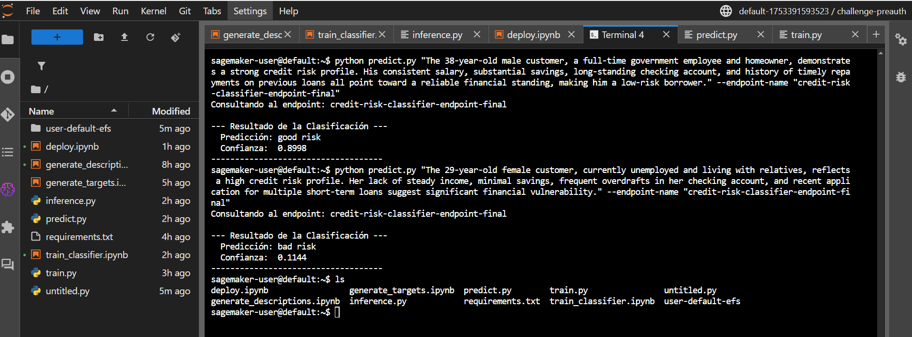

# Challenge AI: Detección de Fraudes en Transacciones Bancarias con Bedrock y SageMaker

Este repositorio contiene la solución completa para el "Challenge AI", un proyecto de Machine Learning de extremo a extremo que aborda la detección de fraudes en transacciones bancarias utilizando servicios de AWS. El flujo de trabajo abarca desde la generación de datos sintéticos y el etiquetado automático con **Amazon Bedrock**, hasta el entrenamiento, la optimización de hiperparámetros y el despliegue de un modelo de clasificación en **Amazon SageMaker**.

## Flujo de Trabajo y Arquitectura de la Solución

La solución implementa un pipeline de MLOps moderno y robusto, dividido en las siguientes fases:

1.  **Primera Fase: Generación de Descripciones:** Se utiliza el dataset inicial (`credir_risk_reto.csv`) y, a través del notebook `generate_descriptions.ipynb`, se invoca a un modelo generativo (Amazon Micro Nova) en Amazon Bedrock para crear una columna `description` para cada transacción. Esta descripción es un resumen en lenguaje natural orientado al riesgo crediticio del perfil.

2.  **Segunda Fase: Etiquetado Automático (Zero-Shot Classification):** Utilizando las descripciones generadas, el notebook `generate_targets.ipynb` vuelve a invocar a Bedrock. Esta vez, se le instruye al modelo para que actúe como un clasificador y asigne una etiqueta de riesgo (`target`) a cada descripción, clasificándolas como "**good risk**" o "**bad risk**". Se implementó una lógica de reintentos con *exponential backoff* para manejar el throttling de la API de Bedrock de manera eficiente.

3.  **Tercera Fase: Entrenamiento Supervisado y Optimización de Hiperparámetros (HPO):** Con el dataset final enriquecido y etiquetado, el notebook `train_classifier.ipynb` orquesta un trabajo de Optimización de Hiperparámetros en SageMaker. Este proceso prueba múltiples combinaciones de hiperparámetros para entrenar un modelo clasificador basado en **DistilBERT** (definido en `scripts/train.py`), con el objetivo de maximizar la métrica `Validation Accuracy`.

4.  **Cuarta Fase: Despliegue del Modelo:** Una vez finalizado el HPO, el notebook `deploy.ipynb` identifica el mejor modelo entrenado, toma sus artefactos (`model.tar.gz`) de S3 y lo despliega en un **endpoint de SageMaker** en tiempo real. Este endpoint está listo para recibir nuevas transacciones y devolver predicciones.

5.  **Quinta Fase: Inferencia y Consumo:** Se proporciona un script cliente, `scripts/predict.py`, que permite a un usuario invocar el endpoint desde la línea de comandos, enviando una nueva descripción de transacción y recibiendo la clasificación de riesgo crediticio en tiempo real.

## Estructura del Repositorio

```
.
├── notebooks/
│   ├── generate_descriptions.ipynb   # Fase 1: Crea la columna 'description'
│   ├── generate_targets.ipynb        # Fase 2: Crea la columna 'target' usando Bedrock
│   ├── train_classifier.ipynb      # Fase 3: Orquesta el entrenamiento HPO en SageMaker
│   └── deploy.ipynb                # Fase 4: Despliega el mejor modelo y lo prueba
│
├── scripts/
│   ├── train.py                    # Script de entrenamiento que ejecuta SageMaker
│   ├── inference.py                # Script de inferencia que usa el endpoint de SageMaker
│   └── predict.py                  # Script cliente para invocar el endpoint
│
├── README.md                       # Este archivo
├── requirements.txt                # Dependencias de Python para el entorno de entrenamiento
└── [INFORME_CHALLENGE.pdf]         # Tu informe detallado
```

## Cómo Ejecutar el Proyecto

Sigue estos pasos para replicar la solución.

### Prerrequisitos
*   Una cuenta de AWS con permisos para **S3**, **Amazon SageMaker** y **Amazon Bedrock**.
*   Las cuotas de servicio de SageMaker apropiadas para instancias `ml.m5.large` de entrenamiento.
*   El dataset inicial `credir_risk_reto.csv`.
*   Tener habilitado el modelo Amazon Nova Prime.

### Pasos de Ejecución

1.  **Configuración Inicial:**
    *   Crea un bucket en S3.
    *   Sube el archivo `credir_risk_reto.csv` a una carpeta dentro de tu bucket (ej. `s3://tu-bucket/raw_data/`).
    *   Abre el entorno de SageMaker Studio y clona este repositorio.

2.  **Generación de Datos (Fases 1 y 2):**
    *   Abre y ejecuta las celdas de los notebooks en la carpeta `/notebooks` en el siguiente orden:
        1.  `generate_descriptions.ipynb` (si lo tienes separado).
        2.  `generate_targets.ipynb`.
    *   Asegúrate de actualizar los nombres de tu bucket S3 en las celdas correspondientes. Al final de este paso, tendrás el archivo `credir_risk_reto_classified.csv` en S3.

3.  **Entrenamiento del Modelo (Fase 3):**
    *   Abre y ejecuta las celdas del notebook `train_classifier.ipynb`. Esto lanzará el trabajo de HPO, que puede tardar varios minutos.

4.  **Despliegue e Inferencia (Fase 4):**
    *   Una vez que el HPO termine, abre y ejecuta las celdas del notebook `deploy.ipynb`. Esto desplegará el mejor modelo en un endpoint.
    *   La Celda 5 del notebook te permite probar el endpoint interactivamente.

5.  **Inferencia desde Cliente Externo:**
    *   Abre una terminal en SageMaker Studio.
    *   Ejecuta el script `predict.py` con una descripción de transacción entre comillas:
      ```bash
      # Ejemplo de bad risk
      python scripts/predict.py "The 29-year-old female customer, currently unemployed and living with relatives, reflects a high credit risk profile. Her lack of steady income, minimal savings, frequent overdrafts in her checking account, and recent application for multiple short-term loans suggest significant financial vulnerability." --endpoint-name "credit-risk-classifier-endpoint-final"

      # Ejemplo de good risk
      python scripts/predict.py "The 38-year-old male customer, a full-time government employee and homeowner, demonstrates a strong credit risk profile. His consistent salary, substantial savings, long-standing checking account, and history of timely repayments on previous loans all point toward a reliable financial standing, making him a low-risk borrower." --endpoint-name "credit-risk-classifier-endpoint-final"
      ```

## Resultados y Decisiones Técnicas

*   **Modelo Seleccionado:** Se utilizó `distilbert-base-uncased` como modelo base debido a su excelente equilibrio entre rendimiento y eficiencia computacional.
*   **Métricas de Desempeño:** El mejor modelo encontrado por el proceso de HPO alcanzó una **Validation Accuracy de 0.88**.
*   **Decisiones Técnicas Clave:**
    1.  **Manejo de Errores de API:** Se implementó una estrategia de reintentos con *exponential backoff* en las llamadas a Bedrock para superar los errores de `ThrottlingException` y asegurar un procesamiento de datos robusto.
    2.  **Optimización de Hiperparámetros:** Se refinó iterativamente el espacio de búsqueda del HPO. Los rangos iniciales amplios causaban inestabilidad en el entrenamiento (`loss: nan`). Se ajustaron los rangos del `learning-rate` y se introdujo un `warmup scheduler` para estabilizar el entrenamiento de "fine-tuning", lo que fue crucial para obtener un modelo exitoso.
    3.  **Gestión de Entornos:** Se resolvieron conflictos de dependencias entre la biblioteca `transformers` y la versión de PyTorch del contenedor de SageMaker, actualizando el `framework_version` del estimador para asegurar la compatibilidad.
    4.  **Clasificación Binaria Bien Fundada:** Se adoptó correctamente `BCEWithLogitsLoss` en combinación con una única salida lineal (`Linear(768, 1)`), lo cual es ideal para tareas de clasificación binaria, ya que garantiza estabilidad numérica y permite entrenar directamente con logits sin necesidad de aplicar `sigmoid` durante el forward pass del modelo.

## Evidencia Funcional

*   **Endpoint:** `[credit-risk-classifier-endpoint-final]`
*   **Video de Presentación:** [Ver la demostración del proyecto aquí](https://www.youtube.com/watch?v=abcdef123)
*   **Presentación:** Presentación detallada, con explicación y resumen del pipeline en el [informe adjunto (PDF)](docs/informe_challenge.pdf)

### Captura de Pantalla del Endpoint

A continuación se muestra el endpoint desplegado y en estado "InService" en la consola de Amazon SageMaker.



## Limpieza de Recursos

Para evitar costos innecesarios, una vez finalizada la revisión, es **imprescindible** eliminar el endpoint de SageMaker. Esto se puede hacer ejecutando la **última celda** del notebook `deploy.ipynb`.
